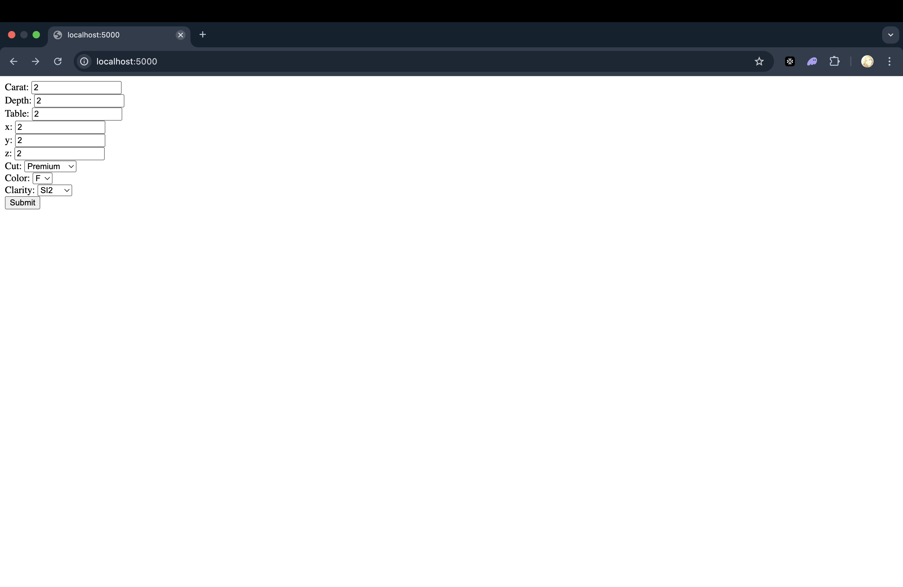
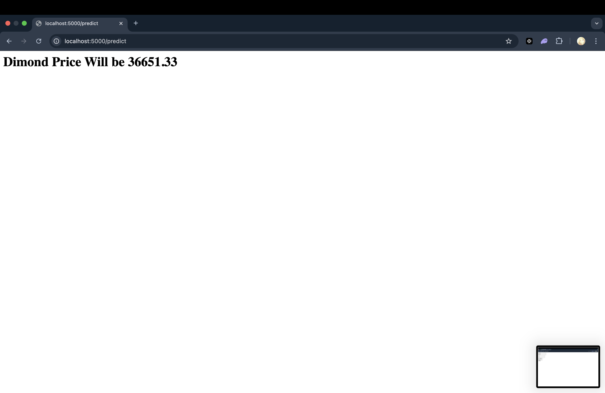

ML Pipeline with MLflow, Airflow, DVC & Docker
This repository contains a complete end-to-end machine learning pipeline setup using MLflow, Airflow, DVC, and Docker. It includes data ingestion, transformation, training, evaluation, and deployment of models with robust logging, exception handling, and experiment tracking.






#  End-to-End ML Pipeline with MLOps

This project is a production-ready end-to-end machine learning pipeline with integrated MLOps practices, including **data ingestion**, **transformation**, **model training**, **evaluation**, **deployment**, and **orchestration** using **Airflow**, **MLflow**, **DVC**, and **Docker**.

---

## 🚀 Project Setup & Installation

### Step 1: Generate Initial Template
```bash
conda create -p venv python=3.8

```

### to activate the 

```bash
conda activate /Users/preetyrai/MLOPS_Gemstone_Price_Prediction/venv

```

### Step 1: Generate Initial Template
```bash
python template.py

```

###  Step 2: Environment Setup
Make sure to initialize the environment.

```bash
bash init_setup.sh

```

This will create a virtual environment (env/ folder).

### Step 3: Install Dependencies

Write your development dependencies in requirements_dev.txt and install them:

``` bash 
pip install -r requirements_dev.txt

```

## ⚙️ Core Module Development 

### Step 4: Exception Handling

Create and test your custom exception class:

``` bash 
python exception.py [path]

```

### Step 5: Logging

Write tests and run them:

``` bash 
python test.py [path]

```


## 🧩 ML Pipeline Components
Create the following files inside the components/ directory:

* data_ingestion.py

* data_transformation.py

* model_trainer.py

* model_evaluation.py

Run ingestion to generate the artifacts/:

``` bash 
python components/data_ingestion.py [path]


```

# 🛠️ Pipeline Integration

## Step 7: Training Pipeline

Create and run your training pipeline:

``` bash 
python pipeline/training_pipeline.py [path]


```

### Step 8: Prediction Pipeline
Create pipeline/prediction_pipeline.py

Create app.py for inference API

Create templates/ folder for frontend

## ⚗️ MLflow Integration
If you face issues with MLflow, follow this:

``` bash 
python -m venv myenv
source myenv/bin/activate  # Mac/Linux
myenv\Scripts\activate     # Windows
pip install setuptools


```

Then start the MLflow UI:

``` bash 
mlflow ui


```


## 🌬️ Airflow Integration
Create airflow/dags/ folder.

Add:

 * batch_prediction.py

 * training_pipeline.py

Start Airflow with Docker:

``` bash 
docker-compose up

```

Access the Airflow UI at:

``` bash 
http://localhost:8080

```


# 🐳 Docker + DVC Setup

## Step 1: Dockerize Your Project
Create:

Dockerfile

docker-compose.yaml

## Step 2: DVC Integration for Airflow
Create:

dvc.yaml


# ☁️ Cloud Integration (CI/CD, Storage)
## DAG Configuration:

* Configure your training pipeline DAG to pull code and data from a cloud repository.

## Batch Prediction:
* Modify the DAG to:

   * Download prediction input from cloud storage.

   * Perform batch predictions.

   * Upload results back to the cloud.


# 📁 Project Structure (Suggested)


``` bash 
├── components/
│   ├── data_ingestion.py
│   ├── data_transformation.py
│   ├── model_trainer.py
│   └── model_evaluation.py
├── pipeline/
│   ├── training_pipeline.py
│   └── prediction_pipeline.py
├── airflow/
│   └── dags/
│       ├── training_pipeline.py
│       └── batch_prediction.py
├── templates/
├── app.py
├── Dockerfile
├── docker-compose.yaml
├── dvc.yaml
├── requirements_dev.txt
├── init_setup.sh
├── template.py
└── README.md

```

# 🧠 Technologies Used

* Python

* MLflow

* Apache Airflow

* Docker

* DVC

* GitHub Actions (optional for CI)

* Cloud Storage (S3/GCS/Azure Blob)

# 📌 Future Enhancements

Add GitHub Actions for CI/CD

Implement model monitoring & drift detection

Integrate with cloud-based feature stores

Add unit and integration tests using pytest

# 🙌 Acknowledgements

Thanks to open-source tools and contributors who make scalable MLOps a reality!


